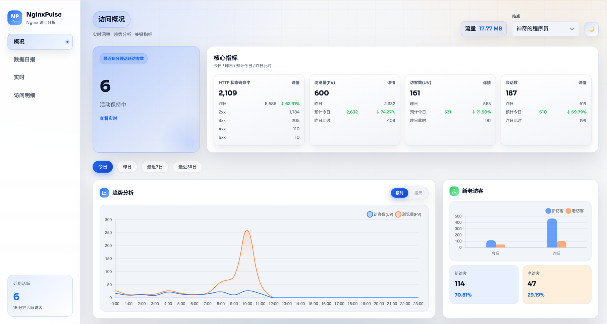
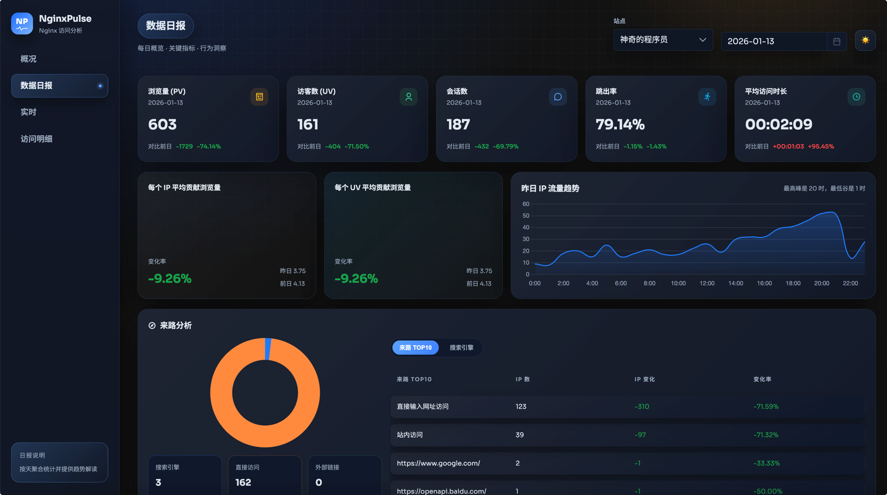

<p align="center">
  
</p>

# NginxPulse

轻量级 Nginx 访问日志分析与可视化面板，提供实时统计、PV 过滤、IP 归属地与客户端解析。




## 目录
- [项目开发技术栈](#项目开发技术栈)
- [IP 归属地查询策略](#ip-归属地查询策略)
- [如何使用项目](#如何使用项目)
- [二次开发注意事项](#二次开发注意事项)
- [目录结构与主要文件](#目录结构与主要文件)

## 项目开发技术栈
- **后端**：`Go 1.23.x` · `Gin` · `Logrus`
- **数据**：`SQLite (modernc.org/sqlite)`
- **IP 归属地**：`ip2region`（本地库） + `ip-api.com`（远程批量）
- **前端**：`Vue 3` · `Vite` · `TypeScript` · `PrimeVue` · `ECharts/Chart.js` · `Scss`
- **容器**：`Docker / Docker Compose` · `Nginx`（前端静态部署）

## IP 归属地查询策略
1. **快速过滤**：空值/本地/回环地址返回“本地”，内网地址返回“内网/本地网络”。
2. **缓存优先**：内存缓存命中直接返回（最多缓存 50,000 条）。
3. **远程优先**：调用 `ip-api.com/batch` 批量查询，超时 1.2s，单批最多 100 个。
4. **本地兜底**：远程失败或结果为“未知”时，IPv4 使用内置 ip2region 数据库本地查询（50ms 超时）。
5. **IPv6 处理**：仅走远程查询，远程失败则返回“未知”。

> 本地数据库 `ip2region.xdb` 内嵌在二进制中，首次启动会自动解压到 `./var/nginxpulse_data/ip2region.xdb`，并尝试加载向量索引提升查询性能。

> 本项目会访问外网 IP 归属地 API（`ip-api.com`），部署环境需放行该域名的出站访问。

## 如何使用项目

### 1) Docker
单镜像（前端 Nginx + 后端服务）：

使用远程镜像（Docker Hub）：

```bash
docker run -d --name nginxpulse \
  -p 8088:8088 \
  -p 8089:8089 \
  -e WEBSITES='[{"name":"主站","logPath":"/share/log/nginx/access.log","domains":["example.com","www.example.com"]}]' \
  -v ./nginx_data/logs/all/access.log:/share/log/nginx/access.log:ro \
  -v "$(pwd)/var/nginxpulse_data:/app/var/nginxpulse_data" \
  magiccoders/nginxpulse:latest
```

本地构建运行：

```bash
docker build -t nginxpulse:local .
docker run -d --name nginxpulse \
  -p 8088:8088 \
  -p 8089:8089 \
  -e WEBSITES='[{"name":"主站","logPath":"/share/log/nginx/access.log","domains":["example.com","www.example.com"]}]' \
  -v ./nginx_data/logs/all/access.log:/share/log/nginx/access.log:ro \
  -v "$(pwd)/var/nginxpulse_data:/app/var/nginxpulse_data" \
  nginxpulse:local
```

> 如果更偏好配置文件方式，可将 `configs/nginxpulse_config.json` 挂载到容器内的 `/app/configs/nginxpulse_config.json`。

### 2) Docker Compose
使用远程镜像（Docker Hub）：将 `docker-compose.yml` 改为下方远程镜像版本，然后执行：

```bash
docker compose up -d
```

本地构建运行（基于源码构建镜像）：保持仓库自带的 `docker-compose.yml`，执行：

```bash
docker compose up -d --build
```

示例 `docker-compose.yml`（远程镜像）：

```yml
version: "3.8"
services:
  nginxpulse:
    image: magiccoders/nginxpulse:latest
    container_name: nginxpulse
    ports:
      - "8088:8088"
      - "8089:8089"
    environment:
      WEBSITES: '[{"name":"主站","logPath":"/share/log/nginx/access.log","domains":["example.com","www.example.com"]}]'
    volumes:
      - ./nginx_data/logs/all/access.log:/share/log/nginx/access.log:ro
      - ./var/nginxpulse_data:/app/var/nginxpulse_data
      - /etc/localtime:/etc/localtime:ro
    restart: unless-stopped
```

示例 `docker-compose.yml`（本地构建）：

```yml
version: "3.8"
services:
  nginxpulse:
    image: nginxpulse:local
    build:
      context: .
    container_name: nginxpulse
    ports:
      - "8088:8088"
      - "8089:8089"
    environment:
      WEBSITES: '[{"name":"主站","logPath":"/share/log/nginx/access.log","domains":["example.com","www.example.com"]}]'
    volumes:
      - ./nginx_data/logs/all/access.log:/share/log/nginx/access.log:ro
      - ./var/nginxpulse_data:/app/var/nginxpulse_data
      - /etc/localtime:/etc/localtime:ro
    restart: unless-stopped
```

说明：
- `logPath` 必须是容器内路径，确保与挂载目录一致。
- `var/nginxpulse_data` 挂载用于持久化数据库和解析缓存，推荐保留。

参数说明（环境变量）：
- `WEBSITES`（必填，无配置文件时）
  - 网站列表 JSON 数组，字段：`name`、`logPath`、`domains`（可选）。
  - `domains` 用于将 referer 归类为“站内访问”，不影响日志解析与 PV 过滤。
- `CONFIG_JSON`（可选）
  - 完整配置 JSON 字符串（等同于 `configs/nginxpulse_config.json` 内容）。
  - 设置后会忽略本地配置文件，其他环境变量仍可覆盖其中字段。
- `LOG_DEST`（可选，默认：`file`）
  - 日志输出位置：`file` 或 `stdout`。
- `TASK_INTERVAL`（可选，默认：`1m`）
  - 扫描间隔，支持 `5m`、`25s` 等 Go duration 格式。
- `SERVER_PORT`（可选，默认：`:8089`）
  - 服务监听地址，可传 `:8089` 或 `8089`，不带冒号会自动补上。
- `PV_STATUS_CODES`（可选，默认：`[200]`）
  - 统计 PV 的状态码列表，可用 JSON 数组或逗号分隔值。
- `PV_EXCLUDE_PATTERNS`（可选，默认内置规则）
  - 全局 URL 排除正则数组（JSON 数组）。
- `PV_EXCLUDE_IPS`（可选，默认：空或配置文件）
  - 排除 IP 列表（JSON 数组或逗号分隔）。

访问：
- 前端：`http://localhost:8088`
- 后端：`http://localhost:8089`

> PV_EXCLUDE_PATTERNS和PV_EXCLUDE_IPS的具体格式请参考[nginxpulse_config.json](configs/nginxpulse_config.json)

### 3) 手动构建（前端、后端）
前端构建：

```bash
cd webapp
npm install
npm run build
```

后端构建：

```bash
go mod download
go build -o bin/nginxpulse ./cmd/nginxpulse/main.go
```

本地开发（前后端一起跑）：

```bash
./scripts/dev_local.sh
```

> 前端开发服务默认端口 8088，并会将 `/api` 代理到 `http://127.0.0.1:8089`。
> 本地开发前请准备好日志文件，放在 `var/log/` 下（或确保 `configs/nginxpulse_config.json` 的 `logPath` 指向对应文件）。

## 多个日志文件如何挂载？
WEBSITES 它的值是个数组，参数对象中传入网站名、网址、日志路径（这个路径为容器内访问的路径，可按照需求随意指定）。
参考示例:
```yaml
environment:
  WEBSITES: '[{"name":"网站1","logPath":"/share/nginx/log/access-site1.log","domains":["www.kaisir.cn","kaisir.cn"]}, {"name":"网站2","logPath":"/share/nginx/log/access-site2.log","domains":["home.kaisir.cn"]}]'
volumes:
  - ./nginx_data/logs/site1/access.log:/share/nginx/log/access-site1.log:ro
  - ./nginx_data/logs/site2/access.log:/share/nginx/log/access-site2.log:ro
```

如果你有很多个网站要分析，一个个挂载太麻烦，你可以考虑将日志目录整体挂载进去，然后在WEBSITES里去指定具体的日志文件即可。

比如：
```yaml
environment:
  WEBSITES: '[{"name":"网站1","logPath":"/share/nginx/log/access-site1.log","domains":["www.kaisir.cn","kaisir.cn"]}, {"name":"网站2","logPath":"/share/nginx/log/access-site2.log","domains":["home.kaisir.cn"]}]'
volumes:
  - ./nginx_data/logs:/share/nginx/log/
```

> 注意：如果你的nginx日志是按天进行切割的，可以使用 * 来替代日期，比如：{"logPath": "/share/nginx/log/site1.top-*.log"}

## 二次开发注意事项

### 环境依赖
- Go 1.23.x（与 `go.mod` 保持一致）
- Node.js 20+ / npm
- Docker（可选，用于容器化）

### 配置与数据目录
- 配置文件：`configs/nginxpulse_config.json`
- 数据目录：`var/nginxpulse_data/`
  - `nginxpulse.db`：SQLite 数据库
  - `nginx_scan_state.json`：日志扫描游标
  - `ip2region.xdb`：IP 本地库
- 环境变量覆盖：
  - `CONFIG_JSON` / `WEBSITES`
  - `LOG_DEST` / `TASK_INTERVAL` / `SERVER_PORT`
  - `PV_STATUS_CODES` / `PV_EXCLUDE_PATTERNS` / `PV_EXCLUDE_IPS`
  
### Nginx 日志格式
默认解析模式基于典型的 access log 格式：
```
<ip> - <user> [time] "METHOD /path HTTP/1.x" status bytes "referer" "ua"
```
如果你的 Nginx 使用自定义 `log_format`，需要同步调整 `internal/ingest/log_parser.go` 中的正则。

#### 示例日志：
```bash
4.213.160.187 - - [31/Dec/2025:15:40:45 +0800] "GET /wp-includes/index.php HTTP/1.1" 404 41912 "https://www.google.fr/" "Mozilla/5.0 (Linux; Android 13; SM-S908E) AppleWebKit/537.36 (KHTML, like Gecko) Chrome/116.0.0.0 Mobile Safari/537.36"
4.213.160.187 - - [31/Dec/2025:15:40:46 +0800] "GET /wp-includes/js/crop/cropper.php HTTP/1.1" 404 41912 "https://www.yahoo.com/" "Mozilla/5.0 (Linux; Android 12; 2201116SG) AppleWebKit/537.36 (KHTML, like Gecko) Chrome/116.0.0.0 Mobile Safari/537.36"
4.213.160.187 - - [31/Dec/2025:15:40:48 +0800] "GET /wp-includes/js/dist/ HTTP/1.1" 404 41912 "https://www.google.fr/" "Mozilla/5.0 (iPhone; CPU iPhone OS 17_1_1 like Mac OS X) AppleWebKit/605.1.15 (KHTML, like Gecko) Version/17.1 Mobile/15E148 Safari/604.1"
10.10.0.1 - - [31/Dec/2025:15:40:48 +0800] "GET / HTTP/1.1" 200 19946 "-" "Mozilla/5.0 (Macintosh; Intel Mac OS X 10_15_7) AppleWebKit/537.36 (KHTML, like Gecko) Chrome/120.0.0.0 Safari/537.36 SafeLine-CE/v9-2-8"
4.213.160.187 - - [31/Dec/2025:15:40:49 +0800] "GET /wp-includes/js/index.php HTTP/1.1" 404 41905 "https://www.yahoo.com/" "Mozilla/5.0 (Linux; Android 13; M2101K6G) AppleWebKit/537.36 (KHTML, like Gecko) Chrome/116.0.0.0 Mobile Safari/537.36"
4.213.160.187 - - [31/Dec/2025:15:40:50 +0800] "GET /wp-includes/widgets/autoload_classmap.php HTTP/1.1" 404 41905 "https://www.google.co.uk/" "Mozilla/5.0 (Linux; Android 10; LM-Q720) AppleWebKit/537.36 (KHTML, like Gecko) Chrome/116.0.0.0 Mobile Safari/537.36"
4.213.160.187 - - [31/Dec/2025:15:40:51 +0800] "GET /wp.php HTTP/1.1" 404 41905 "https://www.google.de/" "Mozilla/5.0 (Linux; Android 12; SM-A525F) AppleWebKit/537.36 (KHTML, like Gecko) Chrome/117.0.0.0 Mobile Safari/537.36"
4.213.160.187 - - [31/Dec/2025:15:40:52 +0800] "GET /.well-known/rk2.php HTTP/1.1" 404 41905 "https://www.google.co.uk/" "Mozilla/5.0 (iPhone; CPU iPhone OS 15_7_9 like Mac OS X) AppleWebKit/605.1.15 (KHTML, like Gecko) Version/15.6.5 Mobile/15E148 Safari/604.1"
4.213.160.187 - - [31/Dec/2025:15:40:53 +0800] "GET /.well-known/x.php HTTP/1.1" 404 41905 "https://www.google.com/" "Mozilla/5.0 (Linux; Android 14; Pixel 8 Pro) AppleWebKit/537.36 (KHTML, like Gecko) Chrome/119.0.0.0 Mobile Safari/537.36"
4.213.160.187 - - [31/Dec/2025:15:40:54 +0800] "GET /wp-admin/maint/chosen.php HTTP/1.1" 404 41905 "https://www.google.com/" "Mozilla/5.0 (Linux; Android 10; LM-Q720) AppleWebKit/537.36 (KHTML, like Gecko) Chrome/116.0.0.0 Mobile Safari/537.36"
4.213.160.187 - - [31/Dec/2025:15:40:55 +0800] "GET /wp-admin/network/autoload_classmap.php HTTP/1.1" 404 41912 "https://duckduckgo.com/" "Mozilla/5.0 (iPhone; CPU iPhone OS 17_0_3 like Mac OS X) AppleWebKit/605.1.15 (KHTML, like Gecko) Version/17.0.1 Mobile/15E148 Safari/604.1"
4.213.160.187 - - [31/Dec/2025:15:40:57 +0800] "GET /wp-admin/s.php HTTP/1.1" 404 41905 "https://www.google.de/" "Mozilla/5.0 (iPhone; CPU iPhone OS 17_0_3 like Mac OS X) AppleWebKit/605.1.15 (KHTML, like Gecko) Version/17.0.1 Mobile/15E148 Safari/604.1"
4.213.160.187 - - [31/Dec/2025:15:40:58 +0800] "GET /wp-admin/w.php HTTP/1.1" 404 41905 "https://www.google.co.uk/" "Mozilla/5.0 (Linux; Android 11; CPH2251) AppleWebKit/537.36 (KHTML, like Gecko) Chrome/116.0.0.0 Mobile Safari/537.36"
4.213.160.187 - - [31/Dec/2025:15:40:59 +0800] "GET /wp-admin/z.php HTTP/1.1" 404 41912 "https://www.google.com/" "Mozilla/5.0 (Linux; Android 13; SM-G991U) AppleWebKit/537.36 (KHTML, like Gecko) Chrome/117.0.0.0 Mobile Safari/537.36"
192.168.30.21 - - [31/Dec/2025:15:40:59 +0800] "GET /morte.arm7 HTTP/1.0" 403 153 "-" "-"
192.168.30.21 - - [31/Dec/2025:15:41:23 +0800] "GET /morte.sh4 HTTP/1.0" 403 153 "-" "-"
14.212.15.74 - - [31/Dec/2025:15:41:36 +0800] "GET /api/content/posts?_r=1767166847811&page=0&size=10&keyword=&sort=topPriority%2CcreateTime%2Cdesc HTTP/1.1" 200 19530 "https://www.kaisir.cn/" "Mozilla/5.0 (Macintosh; Intel Mac OS X 10_15_7) AppleWebKit/537.36 (KHTML, like Gecko) Chrome/143.0.0.0 Safari/537.36"
10.10.0.1 - - [31/Dec/2025:15:41:48 +0800] "GET / HTTP/1.1" 200 19948 "-" "Mozilla/5.0 (Macintosh; Intel Mac OS X 10_15_7) AppleWebKit/537.36 (KHTML, like Gecko) Chrome/120.0.0.0 Safari/537.36 SafeLine-CE/v9-2-8"
192.168.30.21 - - [31/Dec/2025:15:41:53 +0800] "GET /morte.mpsl HTTP/1.0" 403 153 "-" "-"
192.168.30.21 - - [31/Dec/2025:15:42:13 +0800] "GET /morte.spc HTTP/1.0" 403 153 "-" "-"
192.168.30.21 - - [31/Dec/2025:15:42:14 +0800] "GET /morte.i686 HTTP/1.0" 403 153 "-" "-"
192.168.30.21 - - [31/Dec/2025:15:42:40 +0800] "GET /morte.mips HTTP/1.0" 403 153 "-" "-"
10.10.0.1 - - [31/Dec/2025:15:42:48 +0800] "GET / HTTP/1.1" 200 19948 "-" "Mozilla/5.0 (Macintosh; Intel Mac OS X 10_15_7) AppleWebKit/537.36 (KHTML, like Gecko) Chrome/120.0.0.0 Safari/537.36 SafeLine-CE/v9-2-8"
180.97.250.103 - - [31/Dec/2025:15:42:57 +0800] "GET /sdk.51.la/js-sdk-pro.min.js HTTP/1.1" 404 239 "-" "Mozilla/5.0 (Windows NT 10.0; Win64; x64) AppleWebKit/537.36 (KHTML, like Gecko) Chrome/58.0.3029.110 Safari/537.3"
192.168.30.21 - - [31/Dec/2025:15:43:11 +0800] "GET /LjEZs/uYtea.arm7 HTTP/1.0" 403 153 "-" "-"
192.168.30.21 - - [31/Dec/2025:15:43:13 +0800] "GET /LjEZs/uYtea.arm6 HTTP/1.0" 403 153 "-" "-"
10.10.0.1 - - [31/Dec/2025:15:43:48 +0800] "GET / HTTP/1.1" 200 19941 "-" "Mozilla/5.0 (Macintosh; Intel Mac OS X 10_15_7) AppleWebKit/537.36 (KHTML, like Gecko) Chrome/120.0.0.0 Safari/537.36 SafeLine-CE/v9-2-8"
192.168.30.21 - - [31/Dec/2025:15:44:05 +0800] "GET /LjEZs/uYtea.ppc HTTP/1.0" 403 153 "-" "-"
192.168.30.21 - - [31/Dec/2025:15:44:27 +0800] "GET /LjEZs/uYtea.sh4 HTTP/1.0" 403 153 "-" "-"
192.168.30.21 - - [31/Dec/2025:15:44:37 +0800] "GET /LjEZs/uYtea.m68k HTTP/1.0" 403 153 "-" "-"
10.10.0.1 - - [31/Dec/2025:15:44:48 +0800] "GET / HTTP/1.1" 200 19948 "-" "Mozilla/5.0 (Macintosh; Intel Mac OS X 10_15_7) AppleWebKit/537.36 (KHTML, like Gecko) Chrome/120.0.0.0 Safari/537.36 SafeLine-CE/v9-2-8"
192.168.30.21 - - [31/Dec/2025:15:45:19 +0800] "GET /LjEZs/uYtea.x86_64 HTTP/1.0" 403 153 "-" "-"
192.168.30.21 - - [31/Dec/2025:15:45:36 +0800] "GET /LjEZs/uYtea.spc HTTP/1.0" 403 153 "-" "-"
```

#### IP排除问题
配置文件中默认排除了内网地址，如果你想把内网IP的访问也纳入PV的统计范畴中，请传入`PV_EXCLUDE_IPS`参数，值留空(`'[]'`)即可。

## 目录结构与主要文件

```
.
├── cmd/
│   └── nginxpulse/
│       └── main.go                 # 程序入口
├── internal/                       # 核心逻辑（解析、统计、存储、API）
│   ├── app/
│   │   └── app.go                  # 初始化、依赖装配、任务调度
│   ├── analytics/                  # 统计口径与聚合
│   ├── enrich/
│   │   ├── ip_geo.go               # IP 归属地（远程+本地）与缓存
│   │   └── pv_filter.go            # PV 过滤规则
│   ├── ingest/
│   │   └── log_parser.go           # 日志扫描、解析与入库
│   ├── server/
│   │   └── http.go                 # HTTP 服务与中间件
│   ├── store/
│   │   └── repository.go           # SQLite 结构与写入
│   └── web/
│       └── handler.go              # API 路由
├── webapp/
│   └── src/
│       └── main.ts                 # 前端入口
├── configs/
│   ├── nginxpulse_config.json      # 核心配置入口
│   └── nginx_frontend.conf         # 内置 Nginx 配置
├── scripts/
│   └── dev_local.sh                # 本地一键启动
├── var/                            # 数据目录（运行时生成/挂载）
├── Dockerfile
└── docker-compose.yml
```

---

如需更详细的统计口径或 API 扩展，建议从 `internal/analytics/` 与 `internal/web/handler.go` 开始。
